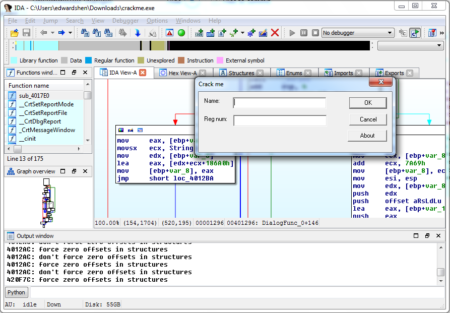
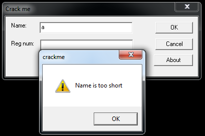
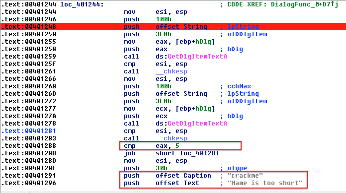
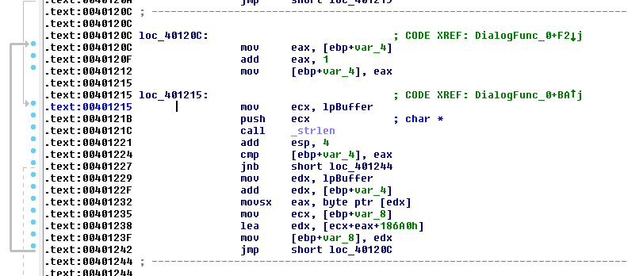
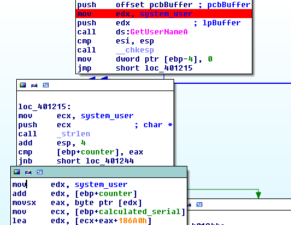
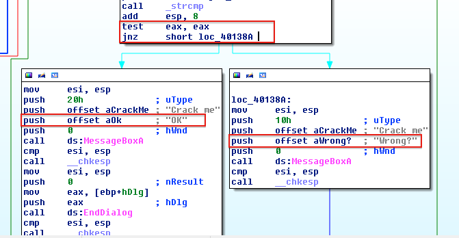
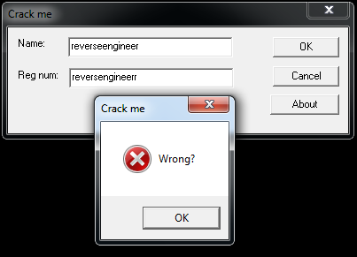
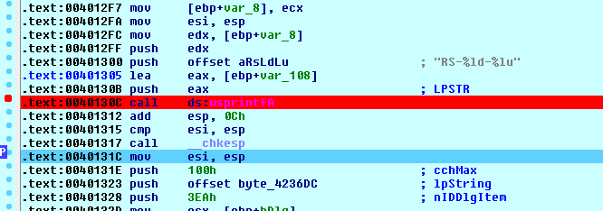
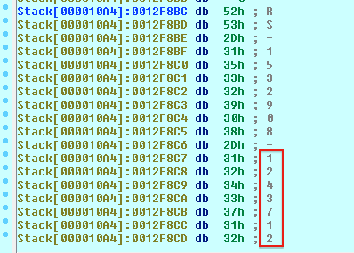
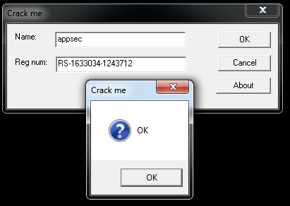

Reverse Engineering Assignment Report
--------------------------------------------------
### Introduction
According to the assignment requirement, I visited [CracksMe Website](http://www.crackmes.de/archive/) and picked an unsolved [crackme.exe](http://crackmes.de/users/als_pom/crackme2/) with difficulty level 1. For tools, I choose to use IDA Pro based on Widows 7. Before cracking the binary program, I loaded the application with IDA and at the same time, run the application independently without debugging environment. Below is a screenshot for the preparation.



### Reverse in Action
Type some garbage information into the message box, we can find the popup message box on invalid input. I prefer to use this approach to find the real starting point of the program. The string "Name is too short" is a great hint for me, as I found out how does the program validate user input and also which variable is used to stored user name:



Open each function in IDA Pro and search for the string, continue with the process we will find this:



We can see that the variable `String` (rename it as `user_name` later) is used to store user name. And if the length of user input is less than 5, the program will pop up the message box says "Name is too short".

What's more, when I checked the 'Imports' tab in IDA Pro, I also found an important hint - the program calls `GetUserName()` function which will return the user's logon name:
> Retrieves the name of the user associated with the current thread. -- [Windows MSDN](http://msdn.microsoft.com/en-us/library/windows/desktop/ms724432(v=vs.85).aspx)

It helps me a lot when I found that two similar loop structures were used in this program. It is not a single round calculation, instead **user input value and logon name are combined together to compute the serial number**.

### Find the `loop`
For `KeyGen`, many algorithms will use a `loop` ( `while` or `for`) control structure to check the user input serial number, so find out the loop in Assembly language is very important for my hacking. IDA Pro provides a very handy and useful sign so that we can easily find loops in "text view" mode:



As the `GetUserName()` is used in one loop, I will first analyze this part:



```ASM
mov     [ebp+counter], 0 ; clear out counter to 0

loc_40120C:              ; Loop Condition
mov     eax, [ebp+counter] ; move counter to EAX register
add     eax, 1           ; increase EAX by 1
mov     [ebp+counter], eax ; move EAX value to counter
mov     ecx, system_user    ; system_user stores user name string
push    ecx              ; char *
call    _strlen
add     esp, 4           ; increase the counter by one integer
cmp     [ebp+counter], eax ;
jnb     short loc_401244 ; when the loop is terminated, jump to loc_401244

loc_401215:              ; Loop Body
mov     edx, system_user         ; move system_user to EDX
add     edx, [ebp+counter]      ; system_user add with counter
movsx   eax, byte ptr [edx]   ; system_user is a pointer, each time move by one char
mov     ecx, [ebp+calculated_serial]      ; target buffer is calculated_serial, move it to register
lea     edx, [ecx+eax+186A0h] ; add calculated_serial and system_user and 100000
mov     [ebp+calculated_serial], edx      ; move the result to calculated_serial
jmp     short loc_40120C
```
After reviewing the Assembly code, we can generate a C code like this:

```c
...
int counter = 0; // counter
int calculated_serial = 0; // calculated_serial
char *system_user = GetUserName(); // system_user
for (counter = 0; counter < strlen(system_user); counter++) {
    calculated_serial += *(system_user++) + 100000;
}
...
```
This is the first round calculation, it is based on user's logon name, each char in the buffer will be added by 100000 and the result will be stored in `calculated_serial` as an integer value. Next, user input string will be used as the second round calculation:

```ASM
loc_4012B1:
mov     [ebp+counter], 0   ; clear out loop counter counter
jmp     short loc_4012C3

loc_4012BA:              ; Loop Condition
mov     edx, [ebp+counter] ; move counter to EDX
add     edx, 1             ; increase EDX by 1
mov     [ebp+counter], edx ; move value from EDX to counter

;; Below is the loop body, we can see that it uses the same structure like loc_401215
loc_4012C3:              ; Loop Body
push    offset user_name ; char *
call    _strlen
add     esp, 4
cmp     [ebp+counter], eax
jnb     short loc_4012EE   ; when the loop terminates, jumps to loc_4012EE
mov     eax, [ebp+counter]
movsx   ecx, String[eax]
mov     edx, [ebp+calculated_serial]
lea     eax, [edx+ecx+186A0h] ;
mov     [ebp+calculated_serial], eax
jmp     short loc_4012BA
```
After reviewing the Assembly code, we can generate a C code like this:
```C
char user_name[LEN] = GetDlgItemText();
for (counter = 0; counter < strlen(user_name); counter++) {
    calculated_serial += user_name[counter] + 100000;
}
...
```
Now, I will analyze the `loc_4012EEE` Assembly Code to figure out how does the program compare the user input serial number with the calculated one.



Notice two different messages and the control flow, this is the final step for the whole program. I tried to type in some garbage input to verify my prediction:




```ASM
loc_4012EE:
mov     ecx, [ebp+calculated_serial]    ; move calculated_serial to ECX
add     ecx, 7A69h                      ; add ECX by a magic number 31337
mov     [ebp+calculated_serial], ecx    ; move back
mov     esi, esp
mov     edx, [ebp+calculated_serial]    ; move calculated_serial to EDX
push    edx                             ; push value to the function call stack
push    offset aRsLdLu  ; "RS-%ld-%lu"  ; result format
lea     eax, [ebp+var_108]              ; move var_108 to the EAX
push    eax             ; LPSTR
call    ds:wsprintfA                    ;
add     esp, 0Ch
cmp     esi, esp
call    __chkesp
mov     esi, esp
push    100h            ; cchMax
push    offset byte_4236DC ; lpString   ; get user input serial number
push    3EAh            ; nIDDlgItem
mov     ecx, [ebp+hDlg]
push    ecx             ; hDlg
call    ds:GetDlgItemTextA
cmp     esi, esp
call    __chkesp
lea     edx, [ebp+var_108]
push    edx             ; char *
push    offset byte_4236DC ; char *
call    _strcmp                         ; compare the two strings
add     esp, 8
test    eax, eax
jnz     short loc_40138A
```

After reviewing the Assembly Code, we can always create a C code:
```c
char var_108[LEN];
char serial[LEN];
calculated_serial = calculated_serial + 31337;
wsprintf(serial, "RS-%ld-%lu", calculated_serial); // Here is the bug! There should be two variables!
input = GetDlgItemTextA(); // get user input serial
if (strcmp(input, caclulated_serial)) != 0) {
    // OK!
} else {
    //Wrong?
}
```

However, when I analyze the format string part, I found that the author (intentionally) leaves a bug in it. When call built-in function `wsprintf`, the author uses two format character `%ld-%lu`, but I can only find one `push` operation which pushes the `calculated_serial` variable. It means that the author missed one variable (`push` operation) for the formated string:
```C
wsprintf(var_108, "RS-%ld-lu", calculated_serial);
```
This implicit bug leads to that for different platform or computers, the second part `%lu` will be a random unsigned integer. At this point, I start to use **Debugging** approach to auditing the general register to find out the missing part.

### Debugging in Action
Get back to the Assembly code, we can find that `var_108` is used to store the formated result, so I add a breakpoint:



After that, press <kbd>F9</kbd> to start debugging, while stopping at the breakpoint, press <kbd>Ctrl+F8</kbd> to step over the `wsprintf` function. Then double click the variable `var_108`, I found a magic number here:



Great! All these hints and glues are enough to create my first `KeyGen` function!

```c
#include <stdio.h>
#include <stdlib.h>
#include <Windows.h>
#define MAX_LEN 100

int main(void)
{
    int counter = 0;
    int calculated_serial = 0;
    char user_name[MAX_LEN];
    char system_user[MAX_LEN];
    char key[1000] = {0};
    DWORD user_name_size = strlen(system_user);

    printf("Please input user name: ");
    scanf("%s", user_name);

    // Get user logon name
    GetUserName((LPSTR)system_user, &user_name_size);

    // first round computation
    for (counter = 0; counter < strlen(system_user); counter++) {
        calculated_serial += system_user[counter] + 100000;
    }
    printf("First round result is %d, logon name %s\n\n",
        calculated_serial, system_user);

    // second round computation
    for (counter = 0; counter < strlen(user_name); counter++) {
        calculated_serial += user_name[counter] + 100000;
    }
    printf("Second round result is %d, user name %s\n\n",
        calculated_serial, user_name);

    calculated_serial += 31337;
    printf("Serial number is %d\n\n", calculated_serial);

    wsprintf(key, "RS-%ld-%lu", calculated_serial, 1243712);
    printf("The key is %s\n", key);

    system("pause");
    return 0;
}
```
And here is the result in front of me!



