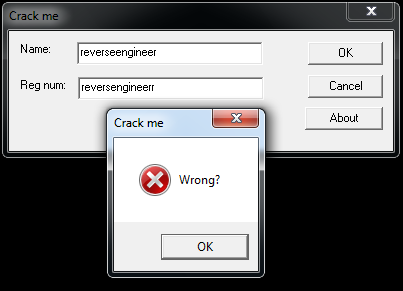

Reverse Engineering Report
===========================
###Introduction
[Great Articles](http://securityxploded.com/reversing-basics-ida-pro.php#References). To fully use IDA Pro for this assignment. 

Project I pick up [Cracke me](http://crackmes.de/users/als_pom/crackme2/)

1. Run the application independently.
2. Load the application with IDA.

As we can see in the picture that the crackme is poping up a message box on invalid input. The string "Wrong?" is an important hint for us to start our work. As this application is written by Visual C++ 6.0, all output text messages should be passed into the [MessageBox](http://msdn.microsoft.com/en-us/library/windows/desktop/ms645505(v=vs.85).aspx) function. 

Now, I start to find the magic string "Name is too short" by openning each function in the IDA and finally I found this message in the function:

 [GetUserName](http://msdn.microsoft.com/en-us/library/windows/desktop/ms724432(v=vs.85).aspx). Now we will backtrace to find out the origin of these message boxes and then figure out that what value will invoke good_boy message box. Starting point of this function is the origin of these message boxes because at the beginning application is calling two GetWindowTextA and we know the purpose of this API from our previous challenge. So application is expecting Name and Serial from user. 